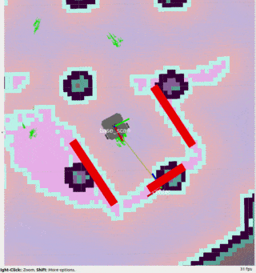

# tko_docking

Subscribe to corner0 and corner1 tf and publishes a center tf used for docking action.

## Run

    rosrun tko_docking center_tf_pub
    rosrun tko_docking center_tf_pub _center_tf:="hello"
    roslaunch tko_docking tko_docking.launch center_tf:="hello"

## Published Topics

## Subscribed Topics

## Parameters

- center_tf (string,default:"center")
  - published tf name of the center tf of the tow corner0 and corner1

## Development

### Linting

In root of workspace

    catkin_make roslint_tko_docking
